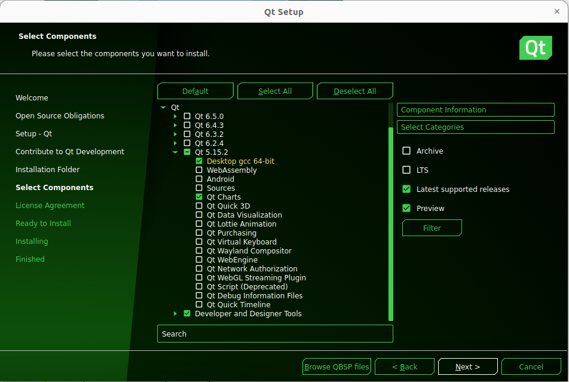

# Complete Guide: Installing TensorFlow 2.12 and PyTorch 2.0

Machine learning has become one of the most promising fields in the technology industry. With the ability to automate decision-making processes, machine learning is changing the way businesses and organizations operate. TensorFlow and PyTorch are two of the most popular deep learning frameworks in the machine learning community. They provide a wide range of functionalities, from building and training neural networks to deploying them on various platforms. In this tutorial, we will guide you through the installation process of TensorFlow 2.12 and PyTorch 2.0 on Ubuntu 22.04. Additionally, we will cover the installation of CUDA and cuDNN, which are necessary components for running machine learning applications on NVIDIA GPUs. So, whether you are a beginner or an experienced developer, this tutorial will provide you with a step-by-step guide to get started with deep learning on Ubuntu. We have chosen the latest version of Pytorch, TensorFlow and Ununtu.

**Step 1: Update the Ubuntu system and install the necessary packages**

The first step is to update the Ubuntu system and install the necessary packages. Open the terminal and run the following commands:

```bash
$ sudo apt update
$ sudo apt install build-essential
$ sudo apt-get install manpages-dev
$ sudo apt install gcc
```

The ```build-essential``` package contains the necessary tools to compile and build software from source code. The ```manpages-dev``` package provides the manual pages for developers. The ```gcc``` package is the GNU Compiler Collection, which is needed for building and running C programs.

**Step 2: Install CUDA and configure the environment variables**

First install the NVIDIA driver from addional drivers and choose the one i have selected.


Next, download the CUDA toolkit from the official website. As of this writing, the latest version is CUDA 11.8.0. Download the runfile installer for Linux x86_64 and save it to a convenient location.

You can directly download via wget

```bash
$ wget https://developer.download.nvidia.com/compute/cuda/11.8.0/local_installers/cuda_11.8.0_520.61.05_linux.run
```

Or You can download the CUDA toolkit from 
[nvidia website](https://developer.download.nvidia.com/compute/cuda/11.8.0/local_installers/cuda_11.8.0_520.61.05_linux.run).

In the terminal, navigate to the directory where the installer is located and run the following command to install CUDA:

```bash
$ sudo sh cuda_11.8.0_520.61.05_linux.run
```

During the installation process, you will be prompted to accept the license agreement, choose the installation directory, and select the components to install. Follow the prompts and only install CUDA Toolkit 11.8


After the installation is complete, open the ~/.bashrc file in a text editor, such as nano, type

```bash
$ nano ~/.bashrc
```

and add the following lines at the end of the file:

```bash
$ export PATH=/usr/local/cuda-11.8/bin${PATH:+:${PATH}}$
$ export LD_LIBRARY_PATH=/usr/local/cuda-11.8/lib64${LD_LIBRARY_PATH:+:${LD_LIBRARY_PATH}}
```

**Step 3: Install cuDNN and configure the environment variables**

Download the cuDNN library from the NVIDIA website. You need to create an account there. Make sure to download the version that corresponds to your CUDA version. As of this writing, the latest version is cuDNN 8.6.0.163 for CUDA 11.8.

You can download from this [link](https://developer.download.nvidia.com/compute/redist/cudnn/v8.6.0/local_installers/11.8/cudnn-linux-x86_64-8.6.0.163_cuda11-archive.tar.xz).

I will recommend open **Download cuDNN v8.6.0 (October 3rd, 2022), for CUDA 11.x** sectionand then download **Local Installer for Linux x86_64 (Tar)**

After downloading the archive, extract it using the following command:

```bash
$ tar -xvf cudnn-linux-x86_64-8.6.0.163_cuda11-archive.tar.xz
```

Copy the header files to the CUDA include directory:

```bash
$ sudo cp cudnn-*-archive/include/cudnn*.h /usr/local/cuda-11.8/include
```

Copy the library files to the CUDA library directory:

```bash
$ sudo cp -P cudnn-*-archive/lib/libcudnn* /usr/local/cuda-11.8/lib64
```

Set the file permissions:

```bash
$ sudo chmod a+r /usr/local/cuda-11.8/include/cudnn*.h /usr/local/cuda-11.8/lib64/libcudnn*
```

Now restart your system using ```sudo reboot``` and in terminal type ```NVCC --version``` to see if everything installed properly otherwise it gives error NVCC not found

**Step 4: Create a virtual environment and install Python packages**

Create a virtual and activate environment for Python using the following command:

```bash
$ sudo apt update
$ sudo apt install python3.10-venv
$ python3 -m venv venv 
$ source venv/bin/activate
(venv) $
(venv) $ deactivate
```

Upgrade packages

```bash
$ sudo apt install python3-pip
$ pip3 install --upgrade pip pip install -U setuptools wheel
```

Install tensorflow and Pytorch

```bash
$ pip3 install tensorflow==2.12.0
$ pip3 install torch torchvision torchaudio
```

Check if PyTorch is using the GPU

```bash
$ python3
>>> import torch
>>> torch.cuda.is_available()
>>> torch.cuda.device_count()
>>> torch.cuda.current_device()
>>> torch.cuda.device(0)
>>> torch.cuda.get_device_name(0)
```

# Install PX4-Autopilot

**Step 1: Download PX4 Source Code**

```bash
$ git clone https://github.com/PX4/PX4-Autopilot.git --recursive
```

**Step 2: Run the ```ubuntu.sh``` with no arguments (in a bash shell) to install everything**

```bash
$ bash ./PX4-Autopilot/Tools/setup/ubuntu.sh
```

**Step 3: Simulation using**

```bash
$ make px4_sitl jmavsim
```

# Install VS Code Editor

**Step 1: Open Command Terminal and Run**

```bash
$ sudo apt update
```

**Step 2: Download VScode**

```bash
$ wget -O vscode.deb 'https://code.visualstudio.com/sha/download?build=stable&os=linux-deb-x64'
``` 

**Step 3: Install Visual Code Binary**

```bash
$ sudo apt install ./vscode.deb
```

# Install MultiDrone-3Drone

**Step 1: Download code**

```bash
$ git clone https://github.com/manhhv87/MultiDrone-3Drone.git
```

**Step 2: Install libraries**

```bash
$ pip3 install mavsdk
$ pip3 install opencv-python==4.7.0.72
$ pip3 install PyQt5==5.13.2
$ pip3 install asyncio
$ pip3 install asyncqt
```

**Step 3: Run GUI**
```bash
$ python3 MyApp.py
```

# Build QGroundControl Ground Control Station

**Step 1: Clone the repo (or your fork) including submodules**

```bash
$ git clone --recursive -j8 https://github.com/mavlink/qgroundcontrol.git
```

Update submodules (required each time you pull new source code):

```bash
$ cd qgroundcontrol
$ git submodule update --recursive
```

**Step 2: Install Qt**

You need to install Qt as described below instead of using pre-built packages from say, a Linux distribution, because QGroundControl needs access to private Qt headers.

**1. Download and run the Qt Online** [Installer](https://www.qt.io/download-open-source)

After set the downloaded file to executable using: 

```bash
$ sudo chmod +x qt-unified-linux-x64-4.5.2-online.run
```

Install to default location for use with 

```bash
$ ./qt-unified-linux-x64-4.5.2-online.run 
```

If you install Qt to a non-default location you will need to modify **qgroundcontrol-start.sh** in order to run downloaded builds.

**2. In the installer Select Components dialog choose: 5.15.2.**

Then install just the following components:

- Desktop gcc 64-bit
- Qt Charts
- Android ARMv7 (optional, used to build Android)



**3. Install Additional Packages (Platform Specific)**

```bash
$ sudo apt-get install speech-dispatcher libudev-dev libsdl2-dev patchelf build-essential curl
```

**4. Install Optional/OS-Specific Functionality**

Install [Video Streaming/Gstreamer](https://github.com/mavlink/qgroundcontrol/blob/master/src/VideoReceiver/README.md)

**5. Disable platform-specific optional features that are enabled (but not installed), by default**

Airmap: Create a file named ```user_config.pri``` (in the repo root directory) containing the text ```DEFINES += DISABLE_AIRMAP```. This can be done in a bash terminal using the command:

```bash
$ echo -e "DEFINES += DISABLE_AIRMAP\r\n" | tee user_config.pri
```
**Step 3: Building**

**1. Building using Qt Creator**

Launch ```Qt Creator``` and open the **qgroundcontrol.pro** project.

In the **Projects** section, select **Desktop Qt 5.15.2 GCC 64bit**

Build using the "hammer" (or "play") icons:


**2. Build using qmake on CLI**

Example commands to build a default QGC and run it afterwards:

Make sure you cloned the repository and updated the submodules before, see chapter Source Code above and switch into the repository folder:

```bash
$ cd qgroundcontrol
```

Create and enter a shadow build directory:

```bash
$ mkdir build
$ cd build
```

Configure the build using the qmake script in the root of the repository:

```bash
$ qmake ../
```

Run make to compile and link. To accelerate the process things you can use the ```-j{number of threads}``` parameter.

```bash
$ make -j12
```

Run the QGroundcontrol binary that was just built:

```bash
./staging/QGroundControl
```

This is the end of tutorial. Hope you like it.
